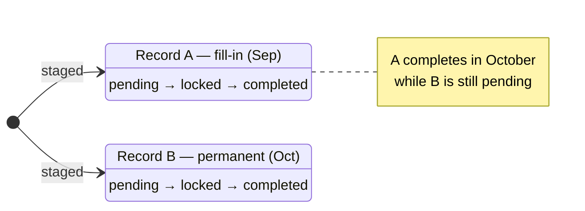

# Future Incumbents — Multiple Staged Replacements Per Position

**Status:** Proposed — awaiting review
**Trigger:** Staff reported that a position can have more than one upcoming incumbent — e.g. a
short-term fill 9/1/26–9/30/26 followed by a different person from 10/1/26.
**Scope:** `future_positions` storage + repository contract + Position Details Future tab +
`FuturePositionsPage` review screen.
**Related:** `docs/plans/emp-record.md` — the *same* one-row-per-parent defect on a different
parent (`person_id` instead of `pos_number`). The two plans should share one UI pattern; see §7.4.

---

## 1. Problem statement

`future_positions` is modelled as **one active row per position**, and the codebase enforces that
assumption in three independent layers. A position that genuinely has a sequence of upcoming
incumbents cannot be represented at all.

### 1.1 The single-row assumption, layer by layer

| # | Layer | Location | Enforces |
|---|-------|----------|----------|
| L1 | Repository guard | `mysql-repository.ts:1575`, `turso-repository.ts:1240`, `fixture-repository.ts:1029` | `SELECT id ... WHERE pos_number = ? AND organization = ? AND status != 'completed' LIMIT 1` → throws `FUTURE_POSITION_EXISTS` |
| L2 | Database index (Turso **only**) | `docs/data/turso/future-positions.sql:52` | `CREATE UNIQUE INDEX idx_future_positions_one_active ON future_positions (pos_number, organization) WHERE status != 'completed'` |
| L3 | Read contract | `contracts.ts:315` | `getForPosition(...): Promise<FuturePosition \| null>` — singular, `... LIMIT 1` |
| L4 | UI state | `client/src/App.tsx:328` | `useState<FuturePosition \| null>(null)` — one record |

L1–L4 are consistent with each other, so the restriction is real and not merely a display
oversight. This is **not** a UI-only change.

It is also **intentional**, not accidental:

- `docs/plans/future-positions.md:350` — *"One active row per position. Enforce exactly one
  non-`completed` row per `pos_number + organization`."*
- `docs/sql/future-positions.mysql.sql:42` — *"One active row per position. MySQL does not support
  partial indexes, so this is enforced in the repository layer."*

So changing this is a **deliberate reversal of a documented product decision**, not a bug fix.
That is the main reason this plan is review-only.

### 1.2 A migration landmine worth knowing about now

The enforcement differs by backend, which will bite during deployment:

| Backend | Enforcement | Risk when we allow multiples |
|---------|-------------|------------------------------|
| MySQL (prod, `DATA_SOURCE=mysql`) | Repository guard only (**no unique index**) | Low — code change is sufficient |
| Turso / SQLite (dev) | Repository guard **+ a real `CREATE UNIQUE INDEX`** | **High** — inserts still fail at the DB layer until the index is dropped |

`docs/sql/future-positions.mysql.sql` has only three **non-unique** indexes
(`idx_future_positions_pos`, `..._status`, `..._submitter`). The dev Turso schema has the extra
unique partial index. **Relaxing the repository guard alone will appear to work in prod and fail
loudly in dev**, which is the reverse of the usual direction and easy to misdiagnose as an
unrelated SQLite quirk.

Removing a partial index in SQLite requires `DROP INDEX` + `CREATE INDEX` (there is no
`ALTER INDEX`), so the migration must be written as an idempotent drop-then-create. The existing
apply script (`scripts/apply-turso-sql.mts`) already tolerates re-runs, but `DROP INDEX` on a
missing index is an error, so it needs a guard.

### 1.3 The date fields are ambiguous — this is the real design problem

The user's example maps to a **range**: 9/1/26 → 9/30/26. The table has **three** date columns:

| Column | Form label | User's example |
|--------|-----------|----------------|
| `hire_date` | "Effective date" | 9/1/26 |
| `contract_start_date` | "Contract Start date" | 9/1/26 |
| `contract_end_date` | "Contract End date" | 9/30/26 |

For the reported case, **"Effective date" and "Contract start" would hold the same value**, so the
data is redundant and there is no single obvious "the range this record occupies". Any overlap
detection or timeline sort must pick one canonical pair — see §7.2.

Two further wrinkles:

- The columns are typed `DATE` in MySQL but **`TEXT`** in Turso, and the API validates them only as
  `z.string().trim().max(32)` (`src/app.ts:346-348`). **No server-side date validation exists.**
  Overlap comparison would therefore be string comparison — which happens to work for ISO
  `YYYY-MM-DD` (lexical order equals chronological order) but silently corrupts on any other
  format. Overlap detection must not ship without real date validation.
- `hire_date`/`contract_*` are all **nullable**, and blank dates are common in current data. Nulls
  have no defined ordering or overlap semantics.

---

## 2. Options

### Option A — Multiple rows, chronological list *(recommended)*
Drop the uniqueness rule; the Future tab becomes a **timeline** of staged records ordered by
effective date.

- ✅ Models the real case with no schema change — every needed column already exists.
- ✅ Chronological order is the natural reading for a handoff ("A, then B").
- ✅ Generalises to 3+ successors with no further design work.
- ⚠️ Each record needs its **own lifecycle** — see §3.3, the hardest consequence.

### Option B — Option A + overlap rejection
As A, plus the server refuses a new record whose date range intersects an existing sibling's.

- ✅ Prevents accidentally staging two people for the same month.
- ⚠️ Requires a defensible null-date rule (§7.2) and date validation that does not exist yet.
- ⚠️ Real handoffs are often messy (a gap, a one-day overlap); hard rejection may be wrong.

### Option C — Replacement rows (successor chain)
Keep one active row; when it completes, create the next.

- ❌ Cannot stage B while A is still `pending`/`locked` — which is exactly the reported need
  (both are known in advance).
- ❌ Adds chain state and ordering guarantees for no benefit.

### Option D — Subtabs within the Future tab ("Incumbent 1" / "Incumbent 2")
Same backend as A; nests a second tab strip inside the first.

- ⚠️ Cramped — the Future tab already sits inside a tab strip inside a drawer.
- ⚠️ Numbered labels duplicate the problem documented in `emp-record.md` §1.2: for these records
  **the dates are the only human-meaningful discriminator**, and "1 / 2" hides them.
- ❌ For non-overlapping sequential records there is no ambiguity to disambiguate, so the extra
  affordance buys nothing.

---

## 3. Recommendation

**Option A, shipped in two phases.** Take B's validation later, once §7.2 is settled, as a *warning*
first rather than a hard reject.

### 3.1 Phase 1 — Relax uniqueness + plural read (backend only)

1. Replace `getForPosition` with `listForPosition` returning **all non-completed rows** for a
   position, ordered deterministically:

   ```ts
   export interface FuturePositionsRepository {
     /** All staged records for a position, earliest effective date first. */
     listForPosition(posNumber: string, organization: string): Promise<FuturePosition[]>;
   }
   ```

   Keep `getForPosition` as a thin wrapper returning `rows[0] ?? null` so the existing route
   consumer does not break mid-migration (same back-compat technique as `emp-record.md` §3.1).

2. **Remove the `FUTURE_POSITION_EXISTS` guard** from all three repositories
   (`mysql`, `turso`, `fixture`). Leave the error code in `repoErrorToStatus` — it becomes
   unreachable but harmless, and removing it is a larger diff than it is worth.

3. **Drop the Turso unique partial index** (`idx_future_positions_one_active`) via an idempotent
   `DROP INDEX IF EXISTS` + non-unique `CREATE INDEX IF NOT EXISTS`. Update the stale header
   comment in both SQL files, which currently documents the one-row rule as decided.

4. Order deterministically. `hire_date` is **nullable**, so an `ORDER BY` on it alone is
   non-deterministic for the blank-date population — the exact class of bug documented in
   `emp-record.md` D1. Use a coalesce plus a tiebreak:

   ```sql
   ORDER BY COALESCE(contract_start_date, hire_date) IS NULL,
            COALESCE(contract_start_date, hire_date),
            created_at
   ```
   (Undated rows last; then earliest date; then insertion order.)

### 3.2 Phase 2 — Timeline UI

- `client/src/App.tsx:328` — `future` becomes `futures: FuturePosition[]`.
- The Future tab lists records as stacked cards with an effective-date heading, reusing the
  existing `.future-position-detail-*` / `record-grid` markup rather than new components.
- Each card carries its own Edit / Add to queue / Send now / Unlock action row
  (`future-position-card-actions`, `App.tsx:712`).

### 3.3 The hard consequence — per-record lifecycle

Today one `status` drives one badge. With N records, **different records legitimately hold
different statuses at the same moment** — this is not an edge case, it is the normal end state of
the reported scenario:



Consequences to decide:

- **The Future tab badge can no longer be a single status** (`App.tsx:569`). Recommendation:
  render a **count** when `n > 1`, and colour it by the **least advanced** status among the
  records — priority `pending` (blue) → `locked` (red) → `completed` (green). Rationale: this tab
  is staff-facing and the least advanced record is always the one requiring staff action. (The
  data-team screen filters by status tab already, so it is unaffected by this rule.)
- **`send-now` / `unlock` / `complete` stay per-record.** No bulk transitions in this feature —
  bulk is what the "Add to queue" work is for.
- The `+` button's meaning changes. It currently doubles as "open the existing pending record for
  edit" (`App.tsx:574`). With multiples, it should always mean **"stage another"**, and editing
  moves entirely to the per-record Edit buttons. This is a behaviour change to an existing
  affordance and needs a UI decision.
- **Loading:** `getFuturePositionForPosition` → a plural fetch. The current effect
  (`App.tsx:359`) sets a single value; it becomes an array assign with the same `active` cleanup.

---

## 4. Files touched

| File | Change |
|------|--------|
| `src/repositories/contracts.ts:315` | Add `listForPosition`; keep `getForPosition` delegating. |
| `src/repositories/mysql-repository.ts:1565, :1575` | Add `listForPosition`; remove `FUTURE_POSITION_EXISTS` guard. |
| `src/repositories/turso-repository.ts:1229, :1240` | Same. |
| `src/repositories/fixture-repository.ts:1019, :1026` | Same. |
| `src/repositories/hybrid-repository.ts` | Pass through `listForPosition`. |
| `src/app.ts:1393` | `GET /api/positions/:posNumber/future` returns an array (see §5). |
| `src/app.ts:1399` | New plural route if the shape change is gated. |
| `src/openapi.ts` | Not affected — documents no future-positions path today. |
| `client/src/api.ts` | `getFuturePositionsForPosition` → `FuturePosition[]`. |
| `client/src/App.tsx:328, :359, :424, :569, :712` | Array state, list UI, per-card actions, aggregate badge. |
| `client/src/FuturePositionsPage.tsx:58, :131` | Grouping already tolerates multiples (`key={item.id}`, not `posNumber`) — verify only. |
| `docs/data/turso/future-positions.sql:52` | Drop the unique partial index; fix the header comment. |
| `docs/sql/future-positions.mysql.sql:42` | Fix the "one active row" comment. |
| `docs/plans/future-positions.md:350` | Amend the resolved decision, or mark it superseded. |
| `client/src/SettingsPage.tsx:673` | Copy says "the record stays pending" — now plural. |

**No column additions and no data migration** are required. The existing `hire_date`,
`contract_start_date`, `contract_end_date` columns already carry the interval.

---

## 5. API shape — the one genuinely breaking decision

`GET /api/positions/:posNumber/future` currently returns a **bare object or `null`**. Returning an
array instead is a breaking change for any other consumer.

| Approach | Trade-off |
|----------|-----------|
| **Change the existing route to an array** | Cleanest contract; breaks the current client in the same deploy. Acceptable if we ship backend + client together. |
| **Add `/api/positions/:posNumber/futures`** | Non-breaking; leaves two near-identical routes and an ambiguous singular one. |
| **Keep object, add `items`** | Worst of both — a hybrid shape. |

Recommendation: **change the existing route to an array** and update the client in the same commit.
The only consumer is `client/src/api.ts` in this repo, and the fixture tests are ours to update.
A `null`-or-object response is the thing that caused L4; leaving it in place invites the same
mistake again.

---

## 6. Testing plan

1. **Repository / route** (`src/app.test.ts`): two records on one `pos_number`; assert both are
   returned, ordered earliest-first, and that the second create **no longer** throws
   `FUTURE_POSITION_EXISTS`.
2. **Null-date ordering**: records with blank `hire_date` and blank `contract_start_date` sort
   **last**, deterministically, across repeated calls.
3. **Per-record lifecycle**: `send-now` one sibling while the other stays `pending`; assert no
   cross-contamination and that the aggregate badge reflects the least advanced status.
4. **Turso index removal**: apply the migration twice (idempotency) and confirm a second insert on
   the same position succeeds afterwards.
5. **Regression**: `fixture-repository` parity, and the existing single-record flow still renders
   as it does today.
6. **Live MySQL probe** (`.mts` script per the established pattern): create a 9/1–9/30 record and a
   10/1 record on one real position; verify both persist and read back in order; clean up.

---

## 7. Open questions for review

1. **Overlap policy.** Reject a new record whose range intersects a sibling, warn but allow, or
   allow silently? (Affects whether we need date validation first.)
2. **Canonical interval.** Which pair is authoritative — `contract_start_date`/`contract_end_date`,
   or `hire_date` alone? Right now "Effective date" and "Contract start" would hold the same value.
   Should the form stop collecting one of them?
3. **Null dates.** Records with no dates — allowed indefinitely, required for a second sibling, or
   sorted last and exempt from overlap checks?
4. **Shared UI pattern.** `emp-record.md` puts tabs on the Employee Record. Should a position's
   multiple future incumbents use the **same** tab pattern for consistency, or is the chronological
   list better here because the records are sequential rather than simultaneous? (My read: the two
   cases are genuinely different — `emp-record` records are *concurrent*, these are *sequential* —
   so different treatments are defensible, but we should decide deliberately rather than drift.)
5. **Badge.** Count, least-advanced status, or both (e.g. blue `2`)?
6. **History.** Should the tab show only upcoming records (`status != 'completed'`, as today), or
   the full timeline including completed siblings?
7. **Scope check.** Is the "Add to queue" page about grouping records **across positions**, or is
   the **within-position succession** the real need? If the latter, that page and this plan are
   the same feature and should be designed together. (Noted in the earlier discussion; still open.)
8. **Ship order.** Is Phase 1 (backend correctness only, no visible change) worth shipping alone,
   or does this only make sense as one delivery with the timeline UI?

---

## 8. Risks & non-goals

**Risks**
- Reversing a documented decision (`future-positions.md:350`) without amending that document leaves
  two contradictory specs in the repo.
- The **Turso-only unique index** (§1.2) makes the failure mode backend-dependent.
- Dropping a unique index is **not** trivially reversible once duplicate rows exist — restoring it
  would fail against real multi-row data.
- The aggregate badge weakens the current "one glance = one status" guarantee. Worth confirming
  staff prefer it before building.
- Date strings are unvalidated (§1.3). Anything built on interval comparison inherits that.

**Non-goals**
- Overlap *detection* in Phase 1 (Phase 2 at the earliest, pending §7.1).
- Bulk transitions across siblings — that belongs to the queue work.
- Per-record layout persistence or review history.
- Any change to `pending → locked → completed` semantics or to `unlock`.
- Oracle export / integration.
