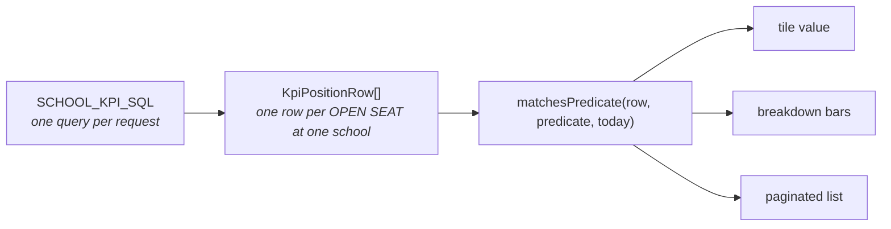

# Plan — Adding daily-refresh tables to the KPI dashboard

**Status:** proposal, awaiting decisions (§9)
**Inputs reviewed:** `docs/data/daily-refresh/daily-data-script.md` (the loader log from your tech staff), `docs/data/sql-response.md` (live `SHOW CREATE TABLE`), `docs/data/turso/schema.sql`, and the **live MariaDB `reporting` database** (4 read-only probes, §14).
**Builds on:** `docs/plans/clickable-kpi-dashboard.md` (the governing KPI plan and its 12 acceptance criteria).

---

## 1. Headline

You asked for a plan to add `EMPLOYEE_INFO_FUTURE`, `MENTOR`, and `RESIGNATIONS`. I verified all three against the live database rather than the loader log, because the log is a snapshot and the live tables have moved on. The result is not what the log suggests:

| Table | Log says | Live says | Verdict |
|---|---|---|---|
| `RESIGNATIONS` | 1,717 rows | **1,757 rows, 1,756 people, 249 orgs — all matching `schools` exactly** | 🟢 **Ready. Build it.** |
| `MENTOR` | 1,494 rows | 1,494 rows, but **a single 2019/20 cohort**, `BT_End` is `0000-00-00` on all 1,494, `Mentor` column 100% blank, 64% unlinkable | 🔴 **Not usable. Recommend not adding.** |
| `EMPLOYEE_INFO_FUTURE` | 27,998 rows | **0 rows** | 🔴 **Blocked. Empty live.** |

So: **one of the three is ready**, one is an empty table, and one is not the thing its name implies.

Two useful side effects of this work regardless of what you decide:
- `RESIGNATIONS` **answers a question that has been open since the first KPI plan** — how to get a real "resignation" signal instead of guessing from `assignment_status` (§5.1.4).
- `EMPLOYEE_INFO_FUTURE` being empty is **silently degrading a report you already ship** (§5.3.1).

---

## 2. Where the log and the database disagree

The log ran `loadAll.sh` on **09/02/26 23:30**, loading 12 tables. Every table has since drifted **upward** by 0.1–0.5% (a later daily load) — except two:

| Table | Log (09/02) | Live (now) | Delta |
|---|---|---|---|
| `address` | 27,929 | 28,016 | +87 |
| `assignment` | 21,924 | 21,982 | +58 |
| `cert_area` | 29,910 | 29,998 | +88 |
| `cert_info` | 15,688 | 15,729 | +41 |
| `education_info` | 25,876 | 25,952 | +76 |
| `employee_info` | 21,944 | 22,003 | +59 |
| **`employee_info_future`** | **27,998** | **0** | **−27,998** ⚠️ |
| `leaves` | 165,633 | 165,831 | +198 |
| `mentor` | 1,494 | 1,494 | **0** ⚠️ |
| `position_info` | 30,677 | 30,720 | +43 |
| `resignations` | 1,717 | 1,757 | +40 |
| `schools` | 346 | 345 | −1 |

**Conclusion:** the log *is* this database — the deltas are consistent across 10 tables. Only `employee_info_future` (all rows gone) and `mentor` (frozen) break the pattern, and both are meaningful rather than noise. `mentor` being byte-identical to a log from 40+ days ago is the first clue that nobody is refreshing it.

---

## 3. How I verified

1. **The log** — what the loader claims, and its timestamp.
2. **The documented schema** — `docs/data/sql-response.md` and the Turso replica `docs/data/turso/schema.sql`, to know the columns without guessing.
3. **Four live probes** against `reporting` (`scripts/_probe-kpi-newtables*.mts`, §14) covering: row counts, indexes, per-column population censuses, distinct-value censuses, school-scope join viability, date ranges, and per-school rollups.

Nothing in the application was changed. The only files created are the four throwaway probe scripts (§14.4).

---

## 4. How the KPI engine works today (the constraint everything must fit)

One catalog, one query, one array:



Three properties make the current dashboard trustworthy, and any new metric must inherit all three:

1. **One grain.** Everything is a `KpiPositionRow` — an **open seat**. `KpiPositionRow[]` is produced by a single query scoped to one school.
2. **One evaluator.** `matchesPredicate` is the *only* definition of a metric. The tile, the bar, and the list all call it, so the number on the tile and the row count of the list **cannot** drift (§4.5 of the KPI plan, the "agreement footer").
3. **One facet axis.** `KpiFacet = 'all' | 'filled' | 'vacant'` — seat status, orthogonal to which metric you are listing.

**This is the central problem with all three requested tables.** A resignation is not a seat — it is a **person who has left**, and they have no open seat, so they cannot appear in `KpiPositionRow[]` at all. Same for `mentor` (a person) and for `employee_info_future` (a *future* seat that does not exist yet). §6 is how I propose to fix that without weakening properties 1–3.

Two smaller couplings worth knowing up front:

- **The tile grid is hard-coded to four columns** — `.kpi-tiles { grid-template-columns: repeat(4, minmax(0, 1fr)) }` (`client/src/styles.css:2486`), matching the 4 tiles in `KPI_TILE_ORDER`. A 5th tile wraps onto a second row at quarter width unless the CSS changes.
- **The drill-down table is hard-coded to seat columns** — `EXPORT_COLUMNS` in `client/src/KpiDrilldownPage.tsx:15` is `['Position #', 'Position Title', 'Category', 'Account', 'Months used', 'Months available', 'Incumbent', 'Employee #', 'Contract end', 'Certificate expires', 'Status']`. A resignation row (person, term date, reason) does not fit that shape, so per-metric column sets are required.

---

## 5. Findings, table by table

### 5.1 `RESIGNATIONS` — 🟢 ready to build

**Shape:** 1,757 rows, **51 columns**, no primary key, **no indexes**, charset `utf8`.

#### 5.1.1 Grain and keys

| Measure | Value | Meaning |
|---|---|---|
| Rows | 1,757 | one row per separation |
| Distinct `person_id` | **1,756** | one person has 2 rows (`249398`) |
| Distinct `emp_number` | 1,756 | agrees |
| Blank `person_id` | **0** | clean key |

So the grain is **one row per person per separation**, and effectively one row per person. `COUNT(*)` and `COUNT(DISTINCT person_id)` agree to within 1 row, which means a "people" metric and an "events" metric are the same number here — and that is worth stating on the definition page rather than hiding.

#### 5.1.2 School scoping works exactly

- `resignations.organization`: **0 blank** values.
- **249 distinct organizations, and 0 of them fail to match `schools.school_name`.**

That is the same join key the existing KPI uses (`position_info.organization = schools.school_name`), so school scoping is a single `WHERE organization = ?` and it is exact. This is the single biggest reason resignations is the easy one.

> Note: `Substitute Teacher Admin - 0835` is a **real row in `schools`** (school_no `0835`) and it is the busiest single organization in the table (91 resignations across Jun–Aug). It is an admin org, not a school — it has exactly **1** `position_info` row. If the school picker lists every `schools` row, this org will show a large resignation count next to a near-empty seat count. That is correct, not a bug, but the definition page should say so.

#### 5.1.3 The reason codes need **no lookup table**

Open question #7 of the KPI plan has been stuck for months on the `object` → staff-category mapping, because it is a hand-built map that can drift. `RESIGNATIONS` has the same problem solved already:

- `leaving_reason` holds **27 codes**.
- `description` holds the human label.
- **`leaving_reason` → `description` is strictly 1:1** — every code maps to exactly one description and vice versa.

So "Resignations by reason" needs **no map in our codebase**. The label comes from the database, on the same row. This is the pattern to prefer, and it is worth contrasting with `object` in the definition doc.

#### 5.1.4 Dates, and the window definition

- `actual_term_date`: min **2026-06-01**, max **2027-01-15**, **0 null**.
- **70 rows are future-dated** (a scheduled/known separation), 1,687 are on or before today.
- `term_year`: 2026 = 1,756, 2027 = 1.
- By month: **Jun 1,211 · Jul 236 · Aug 196 · Sep 74 · Oct 25 · Nov 11 · Dec 3 · Jan 1**.

**The whole table only reaches back to 2026-06-01.** That is not a limitation to work around — it *defines* the metric, and it has to be on the tile (§7.1).

#### 5.1.5 It reproduces the number you already trust

The number in repo memory — *"Resignations 27 (Jun 20, Jul 5, Aug 2)"* — came from a dashboard you had as a reference. From the live table:

```
Athens High School - 318:  Jun 20 + Jul 5 + Aug 2 = 27 rows = 27 distinct people
```

**Exact match.** This is the strongest evidence in this whole review: the table is not merely *plausible* as a resignation source, it is **the source behind the number you already consider correct**. The 27 rows also drill down cleanly — every one has a name, employee number, position, category, and reason (§4 probe output has the full list).

#### 5.1.6 Two column traps

- ⚠️ **`title` is a name prefix, not a job title.** `title` distribution: `Ms.` 878, `Mr.` 361, `Mrs.` 287, `Miss` 98, `Dr.` 19. The job title is **`pos_name`**. A drill-down column labelled "Title" bound to this field would silently be wrong on every row — the worst kind of bug, because it looks fine.
- ⚠️ **`group` is a column name here and `group` is a reserved word in MariaDB.** Any SQL touching it must backtick-quote the column name. This is the same class of trap as the `leading` column.

#### 5.1.7 Column usability for the drill-down

| Column | Population | Use as |
|---|---|---|
| `category` | **100%** (0 blank), 15+ values | ✅ a real staff-category axis |
| `loc_type` | 1,756/1,757 | ✅ Elementary / Middle / High / Main Office |
| `person_type` | **100%** | ✅ |
| `emp_number` | ~100% | ✅ roster key |
| `pos_name` | **430 blank (24%)** | ⚠️ usable as a *filter*, poor as the **primary axis** (would show a large blank bar) |
| `title` | 114 blank | ❌ name prefix — see above |
| `region` | 625 blank (36%) | ⚠️ |
| `grade` / `step` | 93 / 302 blank | ⚠️ |
| `change_reason` | **1,754 of 1,757 blank** | ❌ unusable |
| `hire_date`, `tenure_code`, `continuous_service_date`, `gender`, `ethnicity`, `administrator` | present | available later |

`category` at 100% population is notable — it is a **better** category field than anything the KPI currently has, and it is on the row.

#### 5.1.8 Indexes

Zero. A school-scoped `WHERE organization = ? AND actual_term_date >= ?` is a full scan of 1,757 rows, which is fine *today* at this size. It should be indexed anyway (§9, Q6) because it costs nothing and removes a future surprise.

---

### 5.2 `MENTOR` — 🔴 recommend **not** adding

This is the one to reject, and the evidence is unambiguous.

1. **It is not about mentors.** `Mentor` is **100% blank** (0 non-blank values). So is `Mentor_Eligible_for_Pay`, so is `BT_Coordinating_Teacher`, and so are both notification columns and both comment columns. Seven of the nine detail columns are empty.
2. **It is one historical cohort, not a roster.** `BT_Start` by year: **2019 → 1,430 of 1,494 rows (96%)**, 2020 → 57, 2018 → 6, 2017 → 1. This is essentially a single 2019/20 Beginning-Teacher cohort snapshot.
3. **There is no completion signal.** `BT_End` is `'0000-00-00 00:00:00'` for **all 1,494 rows** — a zero-date sentinel, never populated. (`MAX(BT_End)` looks `NULL` in a naive probe because `mysql2` has no `dateStrings` and turns a zero-date into an Invalid Date; the raw `CAST(... AS CHAR)` shows the truth.) So you cannot tell a completed BT from an abandoned one.
4. **64% of rows cannot be scoped to a school.** `mentor` has **no `organization` column**, so school scoping must go `mentor.PERSON_ID → employee_info.person_id`. **949 of 1,494 rows (63.5%) match no `employee_info` row at all.** Of those 949, only **32** appear in `resignations` — the other 917 are simply older than the resignation extract's 2026-06-01 floor. So for most of the table there is no school to attribute the row to.
5. **The ID spaces are fine** — `mentor.PERSON_ID` and `employee_info.person_id` are both unpadded numeric strings, so the non-joins are real departures, not a formatting mismatch. (Worth confirming: no padding, regexp-numeric on all rows.)
6. **Zero indexes.**
7. **`BT_Status` is undocumented.** Values are `1` (552), `3` (469), `2` (462), `PY` (11). Nothing in the repo defines them; the seed generator *fabricates* plausible translations for demo data, which is worse than nothing because it looks like a source of truth. Without the code semantics, a "BT Status" bar is a bar of unknown meaning.

**What I recommend instead of building it:**

Do not ship a "Mentors" tile — there is no mentor data. Do not ship a "Beginning Teachers" tile either: it would report a cohort that finished six years ago, for a third of which you cannot even name the school. Ask the DBA the three questions in §9 (Q2–Q4), and revisit only if the answers change the picture.

If it later turns out the feed is alive and only `BT_End` is unpopulated, the honest metric is a **people-grain "Beginning Teachers (BT roster)"** with an explicit as-of-date on the tile and a caveat that it is a legacy program roster — *not* a "Mentors" metric.

---

### 5.3 `EMPLOYEE_INFO_FUTURE` — 🔴 blocked, empty live

**The loader says 27,998 rows. The table has 0.**

I checked this hard, because 0 rows is exactly the kind of finding that means "wrong connection string" rather than "empty table":

- **It is the right database.** 10 of 12 tables in the same log match live within 0.5%. Only this one is at zero.
- **The table exists with the full expected schema** — every `employee_info` column plus `start_date`, `end_date`, `Last_PersonNum_In_Position`, `Last_PersonNAME_In_Position`, `Result_Type`, `Supervisor`, `personal_email`, with `KEY pos_number` and `KEY person_id`. So the loader's target table is real and defined; the rows are just not there.
- `information_schema.TABLES.TABLE_ROWS` also reports 0, and `MAX(start_date)`/`MAX(end_date)` are `NULL`.
- `AUTO_INCREMENT` is `NULL`, which is **expected and tells us nothing** — the live table has no auto-increment column (the Turso replica added `id INTEGER PRIMARY KEY AUTOINCREMENT`; live MySQL did not), so there is no "last insert" counter to read.

So the metadata is inconclusive and only one fact is decisive: **the log reports success with 27,998 rows and the table is empty.** Possible causes, in the order I would check them:

1. A later step in the nightly chain **truncates** it (e.g. a staging table cleared after a downstream job).
2. The insert **silently failed** and the loader only counted source rows. Non-strict `sql_mode` makes this plausible — as does `result_type`/`person_id` being `INT UNSIGNED NOT NULL` with no default, which makes any `NULL` person a hard error.
3. The loader wrote to a **different schema or host** for this one table.
4. The table is populated **only during the nightly window** and this is what it looks like the rest of the time.

This is Q1 in §9, and it is the question to ask first — everything else about this table depends on the answer.

#### 5.3.1 It is already degrading a report you ship

Worth flagging, because it is a live issue independent of the KPI work: a report already selects from this table.

`docs/data/report-sql.md` (the "future staff" report) does:

```sql
FROM position_info pi
LEFT JOIN (SELECT ... FROM employee_info_future ei) e
  ON IFNULL(pi.pos_number, 0) = IFNULL(e.pos_number, 0)
```

Because it is a `LEFT JOIN`, **the report does not error — it silently degrades to the plain position list** and shows whatever the seat columns hold, with no future-staff data attached. So if you have been looking at that report and assuming it carries forward-looking staffing data, it has been carrying none.

#### 5.3.2 Landmines to clear before it is used

When the table is populated, four things in the schema will bite:

- **`start_date timestamp NOT NULL DEFAULT CURRENT_TIMESTAMP ON UPDATE CURRENT_TIMESTAMP`** — this column **changes on every write**. It is not a data date and must never be presented as "as of". Only `end_date` (`timestamp NOT NULL DEFAULT '0000-00-00 00:00:00'`) carries data, and it defaults to a zero-date.
- **Zero-dates.** `end_date` defaults to `0000-00-00`, and `mysql2` is configured without `dateStrings`, so it arrives as an Invalid Date — the same trap `mentor.BT_End` sets off. Any query reading these must use `CAST(... AS CHAR)` / `DATE_FORMAT(...)`, and `parseDateOnly` in `kpi-definitions.ts` already handles the `0000-00-00` case correctly once it gets a string.
- **`pos_number` and `person_id` are `INT UNSIGNED NOT NULL`** here, but **`varchar` in `employee_info`**. The existing KPI join already defends against the INT/varchar mismatch with `CAST(... AS UNSIGNED)`; this table makes that mandatory rather than defensive.
- **No index on `organization`** (there is no `organization` index at all, and `employee_info` has **no indexes whatsoever**). A school-scoped query would full-scan ~28k rows.

#### 5.3.3 What it would even mean

If it *is* real, 27,998 rows against `position_info`'s 30,720 suggests it is close to "every position, with next-year state" rather than "the vacancies". That has to be confirmed before a metric can be defined — and the key question is whether it becomes a **better source for the existing Vacant tile** or a **new** metric ("seats not yet filled for next year"), because those are very different products. I would not guess. See §9 Q5.

**Recommendation: gate it.** Do not build a tile on a 0-row table. A tile that reads 0 forever costs support time on every run and teaches people to distrust the dashboard — the same lesson as the expiring-certificate tiles. Build the plumbing behind a flag once the loader is fixed, and treat "table is non-empty" as the entry condition.

---

## 6. The architectural change (this is the real work)

All three tables share one problem: **the engine only knows about open seats.**

`KpiPredicate.base` is `'open_positions' | 'active_assignments'`, and `KpiPositionRow` has exactly one meaning — an open seat at one school, produced by one query. A resignation has no seat. A future seat has no `position_info` row. So the metric family has to grow a second grain, and the question is how to do it **without giving up the property that makes the dashboard trustworthy** (tile value === list total, by construction).

### 6.1 Recommended: a `source` on the metric, an explicit row type per source, one shared parity rule

Add a **source** discriminator to the catalog and keep the evaluator pure:

```ts
// src/types.ts
export type KpiRowSource = 'open_positions' | 'resignations';   // 'future_positions' later
```

Then, per source, a small typed row plus its own repository function:

```ts
export type KpiResignationRow = {
  organization: string;
  termDate: string;          // 'YYYY-MM-DD' — normalized from CHAR, never a Date
  termYear: number;
  termMonth: number;
  personId: string;
  employeeNumber: string;
  fullName: string;
  posName: string;
  category: string;
  locType: string;
  reasonCode: string;
  reasonLabel: string;       // = description; no lookup table needed
  scheduled: boolean;        // termDate > today
};
```

and a matching evaluator, `matchesResignationPredicate(row, predicate, today)`, beside the existing `matchesPredicate`.

**Why this and not one widened `KpiPositionRow`:** widening the seat row with 12 resignation-only nullable fields means every seat metric now type-checks against fields that are always empty for it, and the seat SQL has to project `NULL AS reason_label` to keep the shape. That is how a "can't happen" becomes a production bug. Two row types, two evaluators, one *rule*, is the smaller and safer change — and `selectMetricRows` already proves the parity pattern generalizes (it does exactly this for the `people` grain today: filter, then collapse by person, so the array length *is* the number).

**The rule that must not be relaxed:** for each source, `matches*Predicate` stays the single definition, and the count and the list both go through it. The parity test in `src/app.test.ts` must be extended to loop over every `(metric, source)` pair, not just the current keys. If a metric's tile and its list can ever disagree, the whole design is pointless.

### 6.2 The facet axis has to come from the catalog

`KpiFacet` is `'all' | 'filled' | 'vacant'` **everywhere** — in `src/types.ts`, `client/src/types.ts`, `KPI_FACETS`, `facetPredicate`, `facetCounts` (a required `Record<KpiFacet, number>`), `SchoolKpiRows.facet`, `KpiTarget.facet`, and the hard-coded `FACET_ORDER`/`FACET_LABEL` in `KpiDashboardPage.tsx:9-10`.

"Filled / Vacant" is meaningless for a person who has left. So:

- Widen `KpiFacet` to a string union covering both axes, or make it a plain `string` validated per metric — I would **widen the union**, because the client's ARIA radiogroup and the `radioGroupKeys` keyboard handler are already written against a fixed 3-option list and a `string` type would quietly accept a typo.
- Add the facet options **per metric** to the catalog (`KpiCatalog` already has a `metrics` slice — this belongs there, not in the component).
- The client stops hard-coding `FACET_ORDER`/`FACET_LABEL` and renders whatever the catalog supplies for the current metric. Same 3-option shape, same keyboard behaviour, no ARIA changes.

For resignations the natural axis is **time, not seat status** (§7.1), which is exactly why it cannot be hard-coded in the component.

### 6.3 What this costs, concretely

Every new metric has to be threaded through **all** of these. Sharing the list here so the effort is visible rather than discovered:

| File | Change |
|---|---|
| `src/types.ts` | `KpiRowSource`, `KpiResignationRow`, widen `KpiFacet`, `KpiMetricKey` union, `KpiPredicate` (`source`, resignation fields), `SchoolKpiRows.rows` |
| `src/kpi-definitions.ts` | add to `KPI_METRIC_KEYS`, `KPI_TILE_ORDER` / `KPI_STRIP_ORDER`, `RAW_METRICS`, `KPI_METRICS`; `defaultFacetFor`; a resignation evaluator; `facetPredicate` per source; `buildBreakdown` for a non-`pos_name` axis |
| `src/repositories/mysql-kpi-repository.ts` | a new school-scoped resignation query + `loadResignationRows(organization)` |
| `src/app.ts` | dispatch the payload/rows handlers to the right loader by source |
| `src/app.test.ts` | extend the parity loop to `(metric, source)`; extend the "every metric is documented" test |
| `src/openapi.ts` | the KPI schema |
| `client/src/types.ts` | mirror the server contract |
| `client/src/KpiDashboardPage.tsx` | catalog-driven facets; `tileSub`; `drillBar` picks by source |
| `client/src/KpiDrilldownPage.tsx` | **per-metric `EXPORT_COLUMNS` and row renderer** (line 15 is hard-coded to 11 seat columns) |
| `client/src/styles.css` | `.kpi-tiles` grid (line 2486) if the tile count changes |

The drift risk is real here — this is the same list that makes `KpiMetricKey`, the client mirror, and OpenAPI all have to move together, which is why §7 proposes **one metric first**.

---

## 7. Proposed metrics

### 7.1 Phase 1 — Resignations (the only one I would build now)

**Tile: "Resignations"**

| Property | Value |
|---|---|
| Source | `resignations` |
| Key | `resignations` |
| Unit | `people` (1,756 people vs 1,757 rows — state it) |
| Predicate | `organization = :school` **AND** `actual_term_date >= CURDATE() - 365 days` |
| Window | **trailing 365 days**, carrying `windowDays: 365` so `tileSub` renders `within 365 days` — reusing the existing expiry-tile affordance rather than inventing a new one |
| Drillable | yes → generic list view |

**The honest caveat, and why the window is 365 days.** The table only reaches back to **2026-06-01**. So today, "trailing 365 days" and "the entire table" are the same set — which is a feature, because Athens then reads **27**, exactly the number you already trust. But the tile must say what it means, because in a year it will mean something different. The caveat: *"Resignations recorded in the last 12 months. The district feed currently begins 2026-06-01, so this is the full history as of today."*

**Facet: `All | Separated | Scheduled`** — replaces seat status, and it is genuinely useful:

| Facet | Predicate | District | Athens |
|---|---|---|---|
| All | any `actual_term_date` in window | 1,757 | 27 |
| Separated | `actual_term_date <= CURDATE()` | 1,687 | 27 |
| Scheduled | `actual_term_date > CURDATE()` | **70** | 0 |

"Scheduled" is a real, distinct, actionable list — 70 known upcoming separations district-wide, with names and dates. Athens happens to have 0, which is a good QA case (the tile must render an honest empty state, not a broken bar).

**Breakdown card: "Resignations by month"** — axis = term month, which is what the reference dashboard showed and keeps the card to ≤12 bars against `KPI_BAR_LIMIT = 10`.

> Trade-off, decided: **reason** is arguably more actionable than **month** ("Retired - Reduced Benefits ×5"), but there are 27 reasons, so as an axis it truncates hard. I propose month as the axis and **reason as a drill-down filter**, so both are reachable without either being lossy. If you would rather see reasons on the card, this is a one-line swap of the axis — but say so now, because it changes `buildBreakdown`.

**List view — per-metric columns.** The seat columns do not apply. Proposed:

`Term date · Name · Employee # · Position (`pos_name`) · Category · Reason (`description`) · Type (Scheduled/Separated)`

with the agreement footer naming the concrete predicate, and export (PDF/CSV/Excel) using the same set. **Do not** bind a column to `title` (§5.1.6).

**Why a `pos_name` axis is *not* proposed:** 430 of 1,757 rows (24%) have a blank `pos_name`, so the bars would open with a large unnamed bucket. Month avoids that entirely.

**Indexes to request** (§9 Q6): `resignations (organization, actual_term_date)`. Optional but free.

### 7.2 Phase 2 — `EMPLOYEE_INFO_FUTURE`, **gated on the loader being fixed**

Not a metric design problem; a data problem. The entry condition is *"the table is non-empty and the DBA has told us what one row means."* Then it is one of:

- **(a)** a **new** metric — "Seats not yet filled for next year" (forward-looking, distinct from the Vacant tile); or
- **(b)** a **better source for the existing Vacant tile**, which is a substitution, not an addition, and would need the 4 open questions in §9 Q5 answered first.

I lean (a): the Vacant tile is derived from `position_info` and verified end-to-end; replacing its source is a regression risk with no visible benefit. Until the answer arrives, **flag it off and build nothing.**

### 7.3 Phase 3 — `MENTOR` — **do not build** (see §5.2)

---

## 8. Work plan

### Phase 0 — cleanup (10 min)
1. Delete the four throwaway probe scripts (§14.4) or keep exactly one as `scripts/_probe-kpi-resignations.mts` (the pattern of `_probe-kpi-live.mts` is worth preserving).

### Phase 1 — Resignations (the deliverable)
2. `src/types.ts` — `KpiRowSource`, `KpiResignationRow`, widen `KpiFacet`, `KpiMetricKey += 'resignations'`, `KpiPredicate` gains `source` + resignation fields.
3. `src/repositories/mysql-kpi-repository.ts` — `RESIGNATION_KPI_SQL` (school-scoped, **`CAST` every date to CHAR**, backtick-quote `group` if that column is ever touched) + `loadResignationRows(organization)`.
4. `src/kpi-definitions.ts` — the `resignations` metric; `matchesResignationPredicate`; `RESIGNATION_FACETS`; catalog entries for `KPI_METRIC_KEYS` / `KPI_TILE_ORDER` / `RAW_METRICS` / `defaultFacetFor` / `facetPredicate`; `buildBreakdown` axis support.
5. `src/app.ts` — dispatch by `source`; keep the 403 `SCHOOL_NOT_PERMITTED` path identical.
6. `src/openapi.ts` — schema.
7. `client/src/types.ts` — mirror.
8. `client/src/KpiDashboardPage.tsx` — catalog-driven facet control; `tileSub` shows `within 365 days`; `drillBar` picks by source.
9. `client/src/KpiDrilldownPage.tsx` — per-metric columns + export record.
10. `client/src/styles.css` — `.kpi-tiles` (line 2486) only if a 5th tile is added; `.kpi-bar-fill` is already `display:block` so bars are fine.
11. `src/app.test.ts` — parity loop over `(metric, source)`; documented-metric test; a fixture resignation set including Athens = 27 and an empty-school case.

### Phase 2 — only after the DBA answers
12. `EMPLOYEE_INFO_FUTURE` behind a flag, entry condition = table non-empty.

### Phase 3 — verification
13. Extend `scripts/_probe-kpi-live.mts` (or one script in its image) to assert `tile.value === rows.metricValue` for `resignations`, and to reproduce **Athens = 27** from the API — the same way the existing probe reproduces the fixture counts.

---

## 9. Decisions I need before this is buildable

**To the DBA — `employee_info_future`**
1. `loadAll.sh` on 09/02/26 reported **27,998 rows** for `employee_info_future`. The table is **empty**. Can you confirm whether a later step truncates it, or whether the insert failed? Everything else in that same run matches the live database, so the log is reading the right target for the other 11 tables.
2. What is **one row** of this table — every position, or only positions without a person? And what do `person_id = 0` and `Result_Type` (0–3) mean?
3. Why is there **no index on `organization`**, and can we add `(organization, pos_number)`?

**To the DBA — `mentor`**
4. The table has not changed since 09/02 (byte-identical row count) and `BT_Start` stops at **2020-07-01**, with `BT_End = 0000-00-00` on all 1,494 rows and `Mentor` / `Mentor_Eligible_for_Pay` / `BT_Coordinating_Teacher` **100% blank**. Is this feed still running, or is it a retired 2019/20 export?
5. If it is still running: what do `BT_Status` = `1`, `2`, `3`, `PY` mean, and why is `BT_End` never populated?

**To the DBA — `resignations`**
6. Can we add an index on `(organization, actual_term_date)`?
7. `actual_term_date` starts at **2026-06-01** — is that the feed's retention floor, or the start of the school year? It determines whether "trailing 12 months" is a real window or a synonym for "everything".

**To the business — resignations**
8. **The window.** "Resignations" as trailing 12 months (1,687 / Athens 27 today), or "this school year" (Athens 7), or "this term"? I recommend trailing 12 months because it reproduces the number already in use — but it is a definition, so it is your call.
9. **Scheduled separations.** 70 rows are dated in the future. Should they count in the headline number? I propose: excluded from `Separated`, shown under the `Scheduled` facet, and **included** in `All` so nothing is hidden.
10. **`Substitute Teacher Admin - 0835`** is a `schools` row with 91 resignations and 1 position. Show it, exclude it from the picker, or leave it? (I would leave it — it is a real org with real people — but flag it on the definition page.)
11. **Axis.** Month (my recommendation) or reason on the breakdown card?
12. **Do you want `EMPLOYEE_INFO_FUTURE` at all?** If the answer to Q1 is "the feed is retired", this whole thread can close.

---

## 10. Acceptance criteria (additions to §11 of the KPI plan)

The existing 12 all still apply, unchanged. Every new metric must additionally satisfy:

13. **Parity by source.** The tile/list parity test loops over `(metric, source)`, so a new source cannot ship untested.
14. **Data-readiness gate.** No metric is enabled against a source that returns 0 rows for every school. (This is what would have caught the expiring-certificate tiles and what catches `employee_info_future`.)
15. **No zero-date leaks.** Every date crossing the wire is a `CHAR`/`YYYY-MM-DD` string; `parseDateOnly` handles `0000-00-00`. No `Date` object from `mysql2` reaches a screen. (Regression guard for the `BT_End` trap.)
16. **Field-name truthfulness.** A column labelled "Title" must not be bound to a name prefix, "As of" must not be bound to `ON UPDATE CURRENT_TIMESTAMP`. For every new column, state the source column in the definition.
17. **No hand-maintained label maps.** Where the database carries the label (`resignations.description`), the label is read from the row, not mapped in code. If a map is unavoidable, the definition page says so.
18. The **`group`** column, if used, is backtick-quoted.

---

## 11. Risks

| Risk | Impact | Mitigation |
|---|---|---|
| `actual_term_date` floor is 2026-06-01, not a rolling year | The word "trailing 12 months" becomes wrong over time | Caveat on the tile + Q7 |
| Widen the row model carelessly | Silent wrong numbers instead of type errors | Two row types, two evaluators, parity test over sources (§6.1) |
| The 24% blank `pos_name` | A leading unnamed bar | Axis = month, not `pos_name` |
| `.kpi-tiles` stays at 4 columns | 5th tile renders at quarter width on its own row | Change line 2486 when a tile is added |
| A 0-row tile ships | Permanent "0", erodes trust in the dashboard | Criterion 14 |
| The uncommitted `system_messages` stream | Would land in an unrelated commit | Commit by explicit path; never `git add -A` |
| Resignations is a 1,757-row full scan | Fine now | Request the index (Q6) |

---

## 12. Out of scope

- Implementing any of this (this is a plan; nothing in the app has been changed).
- Any metric derived from `leaves`, `cert_area`, `education_info`, or the `dpi_*` tables — visible in the schema census but outside this request.
- Salary-shaped metrics — still prohibited (acceptance criterion 6).
- The `feature_schemas` / `feature_values` generic storage work in `docs/plans/future-features.md` — though note `future_positions` there is an **application** table (6 rows, our own config) and is **not** `employee_info_future`. Do not conflate them.

---

## 13. Recommendation in one paragraph

Build **Resignations** — it is populated, it is school-scopeable with an exact join, its reason labels need no lookup table, and it reproduces the Athens count of **27** you already trust, which is about as strong a correctness signal as a data source gets. That work is mostly the architectural change in §6 (a second row source with its own row type and facet axis), and the metric itself is small once that lands. **Do not build `MENTOR`**: it holds a 2019/20 Beginning-Teacher cohort, its `Mentor` column is empty, its `BT_End` is a zero-date on every row, and 64% of it cannot be attributed to a school — a tile on it would look fine and be wrong. **Do not build `EMPLOYEE_INFO_FUTURE`** until the loader is fixed: the log says 27,998 and the table is empty, and a tile that reads 0 forever costs you more than it gives. Send the DBA the `employee_info_future` question first — it is the only one that can change the answer.

---

## 14. Appendix — evidence

### 14.1 Live probes run
| Script | Answers |
|---|---|
| `scripts/_probe-kpi-newtables.mts` | first pass: DDL, counts, indexes *(superseded by #2)* |
| `scripts/_probe-kpi-newtables2.mts` | load-log vs live reconciliation, `information_schema` census, mentor column-population census, resignation distributions, `employee_info` status signals |
| `scripts/_probe-kpi-newtables3.mts` | mentor raw dates as `CHAR`, mentor↔`employee_info`↔`resignations` join viability, resignation grain/dedup, org coverage, `employee_info_future` forensics, `s_n_a` contents |
| `scripts/_probe-kpi-newtables4.mts` | resignation column usability, Athens 27-row drill-down, term-window candidates, per-org coverage |

### 14.2 Method notes (worth keeping — these are reusable)
- **`mysql2` has no `dateStrings` here**, so a MySQL zero-date becomes an **Invalid Date**, which `JSON.stringify` renders as `null`. A probe that prints `null` may be hiding `0000-00-00`. Always `CAST(date_col AS CHAR)` when the sentinel is what you are testing. This is what made `mentor.BT_End` initially look like `NULL` instead of all-zero.
- `information_schema.TABLES.AUTO_INCREMENT` is `NULL` (not `0`) for a table with no auto-increment column, so it is **not** a usable "was this truncated?" signal. `TABLE_ROWS` for InnoDB is an estimate; `MAX(...)` on a real column is the ground truth.
- `CREATE_TIME` / `UPDATE_TIME` are **identical across every table in this schema** and `UPDATE_TIME` is `NULL` for all of them, so freshness cannot be inferred from metadata — only from row counts and date columns.

### 14.3 `information_schema` census — other tables present but not in the load log
`dpi_cert_area` (~1.1M), `dpi_cert_info` (~220K), `dpi_education_info` (~784K), `gradestepmismatch` (~536), `grade_step_mismatch` (~589), `s_n_a` (6 rows, dated 2020-05-04 — a stale summary of staffing by `Object Category`, also retired), `schools_example` (0). Tables whose names matched future/stage/mentor/resign: `employee_info_future`, `future_positions` (our own app table), `mentor`, `resignations`.

### 14.4 Created during this review (throwaway)
`scripts/_probe-kpi-newtables.mts`, `scripts/_probe-kpi-newtables2.mts`, `scripts/_probe-kpi-newtables3.mts`, `scripts/_probe-kpi-newtables4.mts`, plus `_probe-newtables*.out.txt` in the repo root. No application file was modified.
