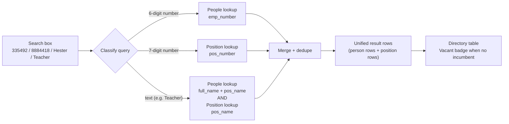

# Unified People & Position Search — Plan

> ## ✅ STATUS: APPROVED (2026-09-11) — NUMBER-ONLY SCOPE
>
> **Decision:** Implement **number-only** search. Title search is **out of scope**
> (a search for `Teacher` returns hundreds of rows — rejected, see §3.3 / §8).
>
> **Confirmed decisions (from the user, 2026-09-11):**
>
> | # | Question | Answer |
> |---|---|---|
> | 1 | Digit-length split | ✅ `emp_number` is **always 6 digits**; `pos_number` is **always 7 digits** |
> | 2 | `888%` positions are Directory targets | ✅ **Yes** — include them (no `NOT LIKE '888%'` exclusion) |
> | 3 | Positions are "recent-searchable" | ✅ **Yes** — add a `recentPositions.ts` parallel to `recentPeople.ts` |
> | 4 | Dedupe policy | ✅ **OK** — show both person and position rows, people first |
> | 5 | Show closed positions | ✅ **Yes (corrected 2026-09-11)** — a pasted position number has **no `pos_ending` filter**; "if it is in the database, show it". Safe because the match is on the exact number, not a title scan. |
> | 6 | Performance / index | ✅ **OK** — accept the scan; request a DBA index if slow |
> | 7 | Title search for positions | ❌ **No** — **position NUMBER only**, never `pos_name` |
> | 8 | Match on `pos_name` | ❌ **Do not use `pos_name`** for matching |
>
> **Consequence:** the classification is now trivial and unambiguous — `^\d{6}$`
> → people, `^\d{7}$` → positions, **everything else → people only** (the existing
> behaviour, unchanged). §3.3 (title search) is **cancelled** and retained only as
> a record of why. `pos_name` is still **displayed** on results, just never matched.

> **Goal:** Make the Directory search box accept **either a person or a position
> number**. Searching an employee number (`335492`) or a position number
> (`8884418`) should both resolve, and the results table should show **one
> consistent row shape**. When a position has **no incumbent**, the Person column
> renders a highlighted **`Vacant`** badge instead of a name.

---

## 1. Problem statement

Today the Directory search box (`client/src/App.tsx` → `runSearch()`) only calls
`getPeople(search, schoolId, session)` which hits `GET /api/people`. That endpoint
filters an in-memory list of `employee_info` rows:

```ts
// src/app.ts  (~line 474)
const matchesSearch = !search || [person.fullName, person.employeeNumber, person.organization]
  .some((value) => value.toLowerCase().includes(search));
```

Consequences:

| User searches for | Today | Desired |
|---|---|---|
| `335492` (employee number) | ✅ matches `employeeNumber` → `Hester, Ms. Alexis Nichelle` | ✅ unchanged |
| `8884418` (position number) | ❌ **no match** — `pos_number` is not in the search tuple | ✅ returns the position, with incumbent or `Vacant` |
| `Teacher` (position title) | ❌ matches only people whose *name/org* contains "Teacher" — `pos_name` is **not** in the match tuple | ✅ returns **both** the people who hold Teacher positions **and** the position rows, incl. compound titles like `Teacher - Recovery` |
| A vacant seat | ❌ invisible — `employee_info` only has filled assignments | ✅ shows the position with a `Vacant` badge |

The root cause is **two disjoint data sources**: people come from `employee_info`
(one row per *assignment*, only filled seats), positions come from `position_info`
(the position master, includes vacant seats). The current Directory only knows
about the first.

### What "8884418" is

`8884418` is a **`position_info.pos_number`** — the 7-digit position identifier.
Note the existing `OPEN_POSITIONS_SQL` deliberately excludes `pos_number NOT LIKE '888%'`
from the *open-positions report* (those are a special class of position). The
Directory search must **not** inherit that exclusion — the whole point is that a
user can paste a number they were given and get the seat back.

---

## 2. Verified current state (2026-09-11)

| Layer | File | Fact |
|---|---|---|
| Client search | `client/src/App.tsx` (`runSearch`, `search` state) | Single `search` string + `schoolId`; calls `getPeople` only. `hasSearched` toggles the table between *recent* and *results*. |
| Client API | `client/src/api.ts` → `getPeople()` | `GET /api/people?search=&schoolId=&page=1&pageSize=50`, sends `scopeHeaders(session)`. |
| Server route | `src/app.ts` → `GET /api/people` | Filters `repositories.people.list()` **in JS** (full `SELECT * FROM employee_info`) on `fullName`, `employeeNumber`, `organization`. |
| People repo | `src/repositories/mysql-repository.ts` → `people.list()` | `SELECT * FROM employee_info` + schools; mapped by `toPerson()`. **No `pos_number` on the `Person` type.** |
| Position detail | `src/repositories/mysql-repository.ts` → `getPositionDetails(posNumber, organization)` | Returns `PositionDetails` with `incumbent: IncumbentSummary \| null` and `vacant: boolean`. **Requires `organization`** — cannot be looked up by number alone. |
| Position master | `position_info` (MySQL) | `pos_number` (INT), `pos_name`, `organization`, `pos_ending`, `fund/purpose/program/object/level/cost_center`. |
| Existing position search | `positionPins.list()` | Already searches `pos_name`, `pos_number`, `incumbent_name`, `employee_number` — but only over **the user's pins**, not the master. |
| Vacancy precedent | `docs/features/position-detail.md` | Position Details drawer already renders a vacant state; reuses `record-drawer`. |

**Key constraint:** `getPositionDetails` needs `organization` to disambiguate a
`pos_number`, because `pos_number` is **not globally unique across organizations**
in the position master. A number-only search must therefore return *all* matching
positions (across visible orgs), not assume one.

---

## 3. Design overview

Introduce a **unified search** that fans out to two sources and merges into one
result shape, then render that shape with a shared table.



### 3.1 The unified row shape

Add a client + server type `DirectoryResult` (working name) that is a **discriminated
union** so the table can render both kinds without guessing:

```ts
// client/src/types.ts + src/types.ts (mirror)
export type DirectoryResult =
  | {
      kind: 'person';
      personId: string;
      employeeNumber: string;
      fullName: string;
      email: string;
      organization: string;
      organizationId: string;
      positionName: string;
      positionNumber: string;   // NEW on the person row — links the two worlds
      vacant: false;
    }
  | {
      kind: 'position';
      positionNumber: string;
      positionName: string;
      organization: string;
      organizationId: string;
      personId: null;
      employeeNumber: string;   // incumbent's, '' when vacant
      fullName: string;         // incumbent's, '' when vacant
      email: string;
      vacant: boolean;          // true → render the Vacant badge
    };
```

> **Why a union and not "positions as fake people":** the two rows have different
> click behavior (person → Employee Record drawer; position → Position Details
> drawer) and different key columns. Modelling that explicitly stops the
> `personId: '8884418'`-style hacks that already exist in
> `openRecordByEmployeeNumber` (it fabricates a `Person` with the number as
> `personId` when a lookup misses).

### 3.2 Query classification

Classify the trimmed query **before** fanning out. This keeps a 6-digit employee
number from also matching position numbers and vice-versa, and keeps text
searches broad.

| Pattern | Interpretation | Sources hit |
|---|---|---|
| `^\d{6}$` | Employee number | People only (`findByEmployeeNumber`-style) |
| `^\d{7}$` (or `^\d{5,8}$`) | Position number | Positions only |
| anything else | Free text | People **and** Positions |

> The exact digit-length split should be confirmed against live data before
> shipping (§7 Open Question 1). `employee_info.emp_number` is 6 digits;
> `position_info.pos_number` is 7 digits in the examples given, but the open-positions
> SQL also filters `'888%'` positions, so verify the real distribution first.

### 3.3 Title search — "Teacher" must return both people *and* position titles

Searching a **word** (not a number) is the most common real-world case, and it
must fan out to **both** sources. A search for `Teacher` should return:

1. **Person rows** — every person whose *position title* contains "Teacher"
   (i.e. `employee_info.pos_name LIKE '%Teacher%'`). These are the filled seats.
2. **Position rows** — every position whose *title* contains "Teacher"
   (i.e. `position_info.pos_name LIKE '%Teacher%'`), **including partial/
   compound titles** like `Teacher - Recovery`, `Teacher - ESL`,
   `Teacher-Regular Classroom`, `Teacher Assistant`.

So `Teacher` returns a mixed result set: the people who *hold* Teacher positions
**and** the position rows themselves — including vacant Teacher seats that no
person row can ever surface.

#### 3.3.1 Match semantics — substring, case-insensitive, on `pos_name`

Both lookups use a **case-insensitive substring** match on the position title
(`pos_name`), **not** a word-boundary or exact match. This is deliberate:

| Search | Must match | Must NOT be treated as exact-only |
|---|---|---|
| `Teacher` | `Teacher - Recovery`, `Teacher - ESL`, `Teacher-Regular Classroom`, `Teacher Assistant` | — |
| `Recovery` | `Teacher - Recovery` | — |
| `Teacher - Recovery` | `Teacher - Recovery` | — |

Implementation: `LOWER(pos_name) LIKE '%' || LOWER(?) || '%'` (MySQL:
`LOWER(pi.pos_name) LIKE CONCAT('%', LOWER(?), '%')`). **Do not** wrap the column
in `TRIM`/`IFNULL` — it is non-sargable and buys nothing (same trap recorded for
`emp_number` in repo memory). `pos_name` is `varchar(255)` with no index; a
`LIKE '%…%'` scan is expected and acceptable at this table's size (see §7 Q6).

#### 3.3.2 Which columns are searched per source

| Source | Columns matched (case-insensitive substring) |
|---|---|
| People | `full_name`, `emp_number`, `organization`, **`pos_name`** ← *new; this is what makes `Teacher` return people* |
| Positions | `pos_name`, `pos_number` |

> **This is the key change vs. today.** `GET /api/people` already matches
> `fullName` / `employeeNumber` / `organization` but **not** `pos_name`, so a
> search for `Teacher` currently returns only people whose *name* or *org*
> contains "Teacher" — i.e. almost nobody. Adding `pos_name` to the people match
> tuple is what makes the title search work on the person side.

#### 3.3.3 Ordering when both kinds match

For a title search the result set can be large, so ordering matters:

1. **Exact title match first** (`pos_name = 'Teacher'`), then
2. **Prefix match** (`pos_name LIKE 'Teacher%'` — this is what puts
   `Teacher - Recovery` near the top), then
3. **Anywhere match** (`pos_name LIKE '%Teacher%'`).
4. Within each tier: **person rows before position rows**, then name/title ascending.

This surfaces the plain `Teacher` seats and their compound variants
(`Teacher - Recovery`) ahead of incidental matches, while still returning
everything.

#### 3.3.4 Position rows for titles are still deduped by seat

The §3.4 dedupe rule applies unchanged: a position row is keyed by
`pos_number` + `organization`. A broad title search may match many positions
across many schools — cap the position side (e.g. 25 rows) and show the
`counts.positions` total so the user knows results were truncated.

### 3.4 Merging

- Run both lookups in parallel (`Promise.all`).
- **Dedupe:** a person row and a position row that describe the *same seat*
  (same `pos_number` + `organization`) are **both kept** — they answer different
  questions ("who is this person" vs "tell me about this seat"). If that proves
  noisy, collapse position rows whose `pos_number` already appears on a returned
  person row, behind a `showPositions` toggle. Default: keep both, person rows first.
- **Ordering:** exact number matches first (so `335492` is row 1), then people,
  then positions; within each group, name/title ascending.
- **Cap:** reuse the existing page size (50). Positions are capped separately
  (e.g. 25) so a broad text search can't drown the people results.

---

## 4. Backend plan

### 4.1 New repository method — position search

Add to `PositionsRepository` (`src/repositories/contracts.ts`):

```ts
export interface PositionsRepository {
  getPositionDetails(posNumber: string, organization: string): Promise<PositionDetails | null>;
  /** Directory search: positions matching a number or title, scoped to visible orgs. */
  search(filter: PositionSearchFilter): Promise<PositionSearchHit[]>;
}

export type PositionSearchFilter = {
  search: string;
  organizationIds?: string[];   // school scope (org NAMES, matching employee_info.organization)
  limit?: number;
};

export type PositionSearchHit = {
  positionNumber: string;
  positionName: string;
  organization: string;
  organizationId: string;
  incumbentName: string;        // '' when vacant
  incumbentEmployeeNumber: string;
  incumbentPersonId: string;
  vacant: boolean;
};
```

Implement in **mysql / turso / fixture / hybrid** (hybrid inherits via
`positions: mysqlRepositories.positions`). The MySQL query mirrors
`POSITION_DETAIL_SQL`'s join so the vacancy signal is identical to the drawer:

```sql
SELECT
  pi.pos_number,
  pi.pos_name,
  pi.organization,
  IFNULL(e.full_name, '')    AS full_name,
  IFNULL(e.emp_number, '')   AS emp_number,
  e.person_id
FROM position_info pi
LEFT JOIN employee_info e
  ON IFNULL(CAST(e.pos_number AS UNSIGNED), 0) = IFNULL(CAST(pi.pos_number AS UNSIGNED), 0)
WHERE CAST(pi.pos_number AS CHAR) = ?
  -- NO pos_ending filter: a pasted number is a deliberate lookup, so an ENDED
  -- seat still resolves (e.g. 8884418 = "Teacher - Recovery", ended 2026-08-15).
  -- AND pi.organization IN (?, ?, ...)   -- only when scoped
ORDER BY
  pi.organization,
  CASE WHEN e.primary_flag = 'Y' THEN 0 ELSE 1 END,
  COALESCE(e.contract_start, '1900-01-01') DESC,   -- CURRENT incumbent
  COALESCE(e.hire_date, '1900-01-01') DESC
LIMIT ?;
```

**Gotchas to carry over (verified in repo memory):**

- `position_info.pos_number` is **INT**, `employee_info.pos_number` is **varchar** →
  the join **must** cast both sides (`CAST(... AS UNSIGNED)`), as `POSITION_DETAIL_SQL` does.
- **Do NOT** add `pi.pos_number NOT LIKE '888%'` — that exclusion belongs to the
  open-positions *report*, not the Directory. Searching `8884418` must work.
- `pos_number` is **not unique per organization** → return **all** matches, not `LIMIT 1`.
- `employee_info` is per-assignment → one position can join to several rows; the
  Directory wants **one row per position**, so pick the primary assignment with the
  same deterministic ordering already used by `findByEmployeeNumber`
  (`primary_flag='Y'` → `pos_number` → `hire_date`), or `GROUP BY pi.pos_number`
  with `MIN(...)`. Prefer the deterministic `ORDER BY` + dedupe in JS for clarity.
- `pi.pos_ending` filter: reuse the open-positions predicate so a closed position
  does not appear as a live seat.

### 4.2 New endpoint — `GET /api/directory`

A single endpoint keeps the client simple and lets the server own classification
and merging.

```
GET /api/directory?search=8884418&schoolId=&page=1&pageSize=50
GET /api/directory?search=Teacher&schoolId=&page=1&pageSize=50
```

- Extend `querySchema` (or add `directoryQuerySchema`) — `search` required & non-empty
  (return `400 SEARCH_REQUIRED` on blank so the client can't accidentally trigger a
  full-table scan).
- Apply the **same school scoping** as `/api/people` (`hasSchoolScope` /
  `canViewAllSchools` / `callerSchoolIds`). Positions are scoped by
  `organization` NAME (positions have no `organizationId` column — resolve against
  `repositories.schools.list()`, exactly as `/api/employees/lookup` does).
- **Text queries fan out to both sources** (§3.3): the people side must add
  `pos_name` to its match tuple, and the position side matches `pos_name` /
  `pos_number`. Numeric queries hit a single source (§3.2).
- Response:

```ts
{
  data: DirectoryResult[],   // merged, ordered
  page, pageSize, total,
  counts: { people: number; positions: number }   // for the "N results" affordance
}
```

- **Keep `GET /api/people` unchanged** — it is used by `openRecordByEmployeeNumber`
  and by any other consumer; changing its shape is a needless break.

### 4.3 OpenAPI

Add `/directory` to `src/openapi.ts` (tags `['People']` or a new `Directory` tag)
with the `search` / `schoolId` / `page` / `pageSize` params and a `DirectoryResult`
schema, mirroring the existing `/people` block.

---

## 5. Frontend plan

### 5.1 API client

Add to `client/src/api.ts`:

```ts
export function getDirectory(search: string, schoolId: string, session?: LoginSession | null): Promise<DirectoryPage> {
  const params = new URLSearchParams({ search: search.trim(), page: '1', pageSize: '50' });
  if (schoolId) params.set('schoolId', schoolId);
  return request<DirectoryPage>(`/api/directory?${params.toString()}`, { headers: scopeHeaders(session) });
}
```

### 5.2 Directory state

`App.tsx` currently holds `people: Person[]`. Introduce
`results: DirectoryResult[]` for the searched state while **keeping `people`
for the recent list** (recents are always people — a position is never "recently
searched" in the same sense; see §7 Open Question 3).

Minimal-diff approach:

- Keep `people` + `recentPeople` exactly as-is for the **landing / recent** view.
- Add `results: DirectoryResult[]` populated by `runSearch()` via `getDirectory`.
- The table renders `hasSearched ? results : recentPeople.map(toPersonResult)`.

### 5.3 Table rendering

The table header is unchanged (`Person | Organization | Position | Employee no. | Open`),
but each row now renders from a `DirectoryResult`:

| Column | Person row | Position row (filled) | Position row (**vacant**) |
|---|---|---|---|
| Person | `fullName` + `email` | incumbent `fullName` | **`<span className="badge badge-vacant">Vacant</span>`** |
| Organization | `organization` | `organization` | `organization` |
| Position | `positionName` | `positionName` | `positionName` |
| Employee no. | `employeeNumber` | incumbent `employeeNumber` | `—` (em dash) |
| Open | → Employee Record drawer | → Position Details drawer | → Position Details drawer |

**Vacant badge** — new CSS class in `client/src/styles.css`, following the
existing badge/token conventions:

```css
.badge-vacant {
  display: inline-block;              /* NOT inline — % / padding collapse */
  padding: 2px 8px;
  border-radius: var(--style-radius-sm);
  font-size: 0.72rem;
  font-weight: 600;
  letter-spacing: 0.04em;
  text-transform: uppercase;
  background: var(--warning-soft, #fde8d7);
  color: var(--warning-strong, #8a4b12);
  border: 1px solid var(--warning-border, #f0c9a8);
}
```

> **Must add two more rules, per repo convention:**
> 1. A `[data-style]` override so an admin style's palette drives the badge.
> 2. A `[data-theme="dark"][data-style]` override so it is legible in dark mode.
> Skipping either is the exact bug class recorded in repo memory
> ("any new styled surface needs a matching rule in BOTH blocks").

Also add `.badge-vacant` to the `[data-style]` **radius** block so it follows the
style's corner token.

### 5.4 Row click routing

Split the row click by `kind`:

```tsx
onClick={() => result.kind === 'person'
  ? void selectPerson(resultAsPerson(result))
  : void openPositionByNumber(result.positionNumber, result.organization)}
```

- `openPositionByNumber(posNumber, organization)` **already exists** and opens the
  Position Details drawer — reuse it verbatim. It needs the organization, which
  the position row carries.
- Person rows keep the existing `selectPerson` → Employee Record drawer, and keep
  feeding the recent list.
- Position rows are **not** added to the recent-people list.

### 5.5 Empty / error states

- `No people match the current filters.` → `No people or positions match “{search}”.`
- Keep the existing `error` notice for a failed request.
- Show the `counts` split when both kinds are present, e.g.
  `3 results · 2 people · 1 position`.

### 5.6 Placeholder / copy

Update the input placeholder and hero copy:

- placeholder: `Name, employee no., position no., or position title`
- hero copy: `Search employee records and positions by name, employee number, position number, or position title (e.g. Teacher).`

---

## 6. Implementation checklist

| # | Task | File(s) |
|---|---|---|
| 1 | Add `DirectoryResult` / `PositionSearchHit` / `DirectoryPage` types | `src/types.ts`, `client/src/types.ts` |
| 2 | Add `PositionsRepository.search()` to the contract | `src/repositories/contracts.ts` |
| 3 | Implement `positions.search()` (mysql) + mirror in turso/fixture | `src/repositories/mysql-repository.ts`, `turso-repository.ts`, `fixture-repository.ts` |
| 4 | Add `GET /api/directory` route + `directoryQuerySchema` + scoping | `src/app.ts` |
| 5 | Add `pos_name` to the **people** match tuple (title search) | `src/app.ts` (`/api/directory` handler) |
| 6 | Document `/directory` in OpenAPI | `src/openapi.ts` |
| 7 | Add `getDirectory()` client API | `client/src/api.ts` |
| 8 | Add `results` state + `runSearch()` switch to `getDirectory` | `client/src/App.tsx` |
| 9 | Render union rows + Vacant badge + row-click routing | `client/src/App.tsx` |
| 10 | `styles.css`: `.badge-vacant` + `[data-style]` + dark-mode + radius rules | `client/src/styles.css` |
| 11 | Update placeholder / hero copy / empty state | `client/src/App.tsx` |
| 12 | Tests: number classification, **title search returns both kinds**, vacant row, scoping | `src/app.test.ts` |
| 13 | Verify against live MySQL (`335492`, `8884418`, `Teacher`, `Teacher - Recovery`) | manual / probe script |

---

## 7. Open questions (confirm before coding)

1. **Digit-length split.** Is `emp_number` always 6 digits and `pos_number`
   always 7? If they overlap, classification must fall back to "search both and
   merge" rather than guessing. *Verify against live data first.*
2. **`888%` positions.** The open-positions report excludes `pos_number LIKE '888%'`.
   Confirm those are legitimate Directory targets (the request implies yes) and
   that including them does not surface internal/non-staffing seats.
3. **Are positions "recent-searchable"?** The plan assumes no (recents stay
   people-only). If positions should also be remembered, `recentPeople.ts` needs a
   parallel `recentPositions.ts` with the same per-user localStorage pattern.
4. **Dedupe policy.** When a text search returns both a person and their own
   position, do we show two rows or collapse? Plan default: show both, people first.
   This is especially visible for `Teacher`: expect a person row **and** a position
   row for the same seat. Confirm that is the desired UX.
5. **Closed positions.** Should the Directory show a position whose `pos_ending`
   is in the past (a former seat)? Plan default: no — reuse the open-positions
   predicate.
6. **Performance.** `/api/people` already loads the **entire** `employee_info`
   table and filters in JS (a known timeout risk). The new position query is
   `LIKE`-driven and **non-sargable**; confirm acceptable latency on live data and
   consider a `pos_number` index request to the DBA if the Directory is slow
   (same pattern as `docs/sql/employee-lookup-index.mysql.sql`).
7. **Title-search breadth.** `Teacher` will match a **large** set (every Teacher
   seat at every visible school, filled and vacant). Confirm the position-side cap
   (25) and whether the people side should also cap or paginate. Consider whether
   a minimum query length (e.g. 2–3 chars) is needed to prevent a single letter
   from scanning everything.
8. **`pos_name` variants.** Live titles are inconsistent (`Teacher - Recovery`,
   `Teacher-Regular Classroom`, `Teacher Assistant`). Substring matching handles
   all of them, but confirm there is no title where a user would expect a match
   that substring misses (e.g. an abbreviation like `Tchr`).

---

## 8. Out of scope

- Changing the Reports page row-click behavior (already column-aware per
  `docs/features/position-detail.md`).
- Changing `GET /api/people`'s response shape.
- Position auto-lookup / autocomplete as you type (this plan is submit-to-search,
  matching today's Directory).
- Any salary data (per the standing "no salary metric" rule).
